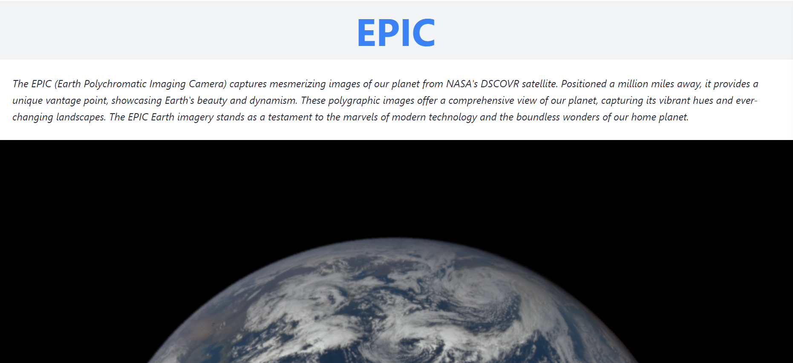
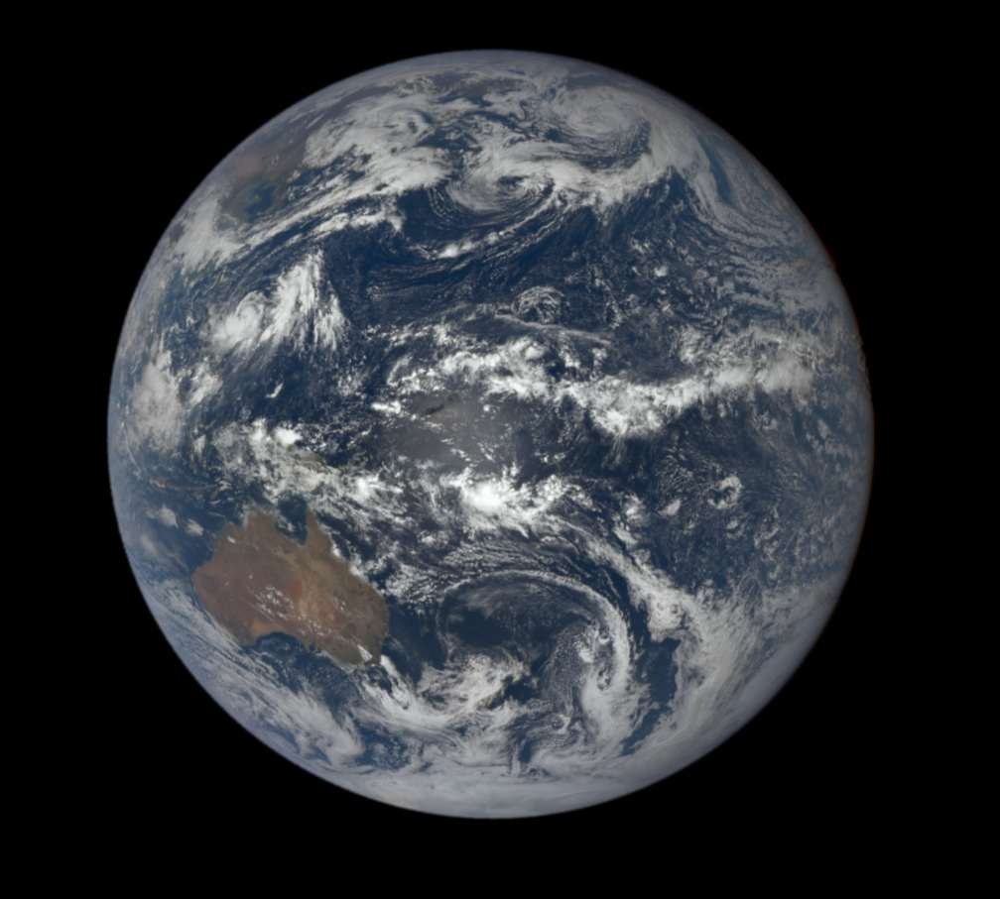
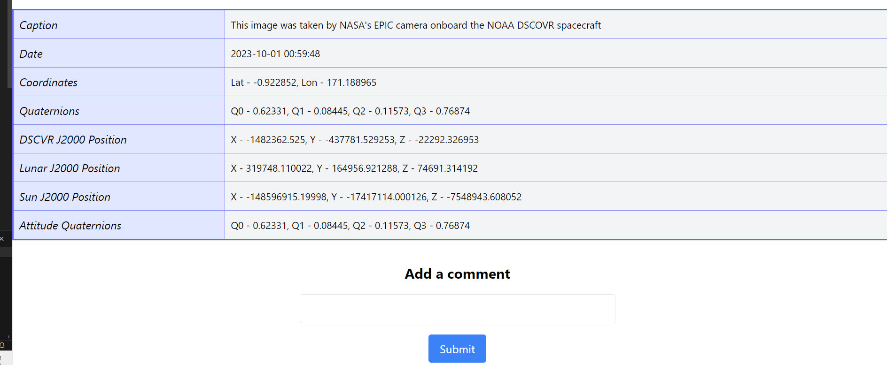

# EPIC

The EPIC (Earth Polychromatic Imaging Camera) captures mesmerizing images of our planet from NASA's DSCOVR satellite. Positioned a million miles away, it provides a unique vantage point, showcasing Earth's beauty and dynamism. These polygraphic images offer a comprehensive view of our planet, capturing its vibrant hues and ever-changing landscapes. The EPIC Earth imagery stands as a testament to the marvels of modern technology and the boundless wonders of our home planet.

## LINK

[Link](https://cheerful-pixie-807170.netlify.app/)

## Screenshots

-------------------------------

--------------------------------

--------------------------------

## How to Use the App

## Technologies Used 
 - MERN
   (Mongo,Express.js,React and Node.js)
- API's
- Tailwind
- Netlifly 
- Heroku 

## IceBox Features
- Able to edit or delete comments
- Able to more planets to list
- Able to calculate Age on each planet 
- Able to see Weather on mars

## Resources
- [NASA - Free API's](https://api.nasa.gov/)

## [Trello](https://trello.com/invite/b/cylHjsld/ATTI8c05976fbf152bc2d93d8bb67cb4cddc0CE64DAC/project4)
   
